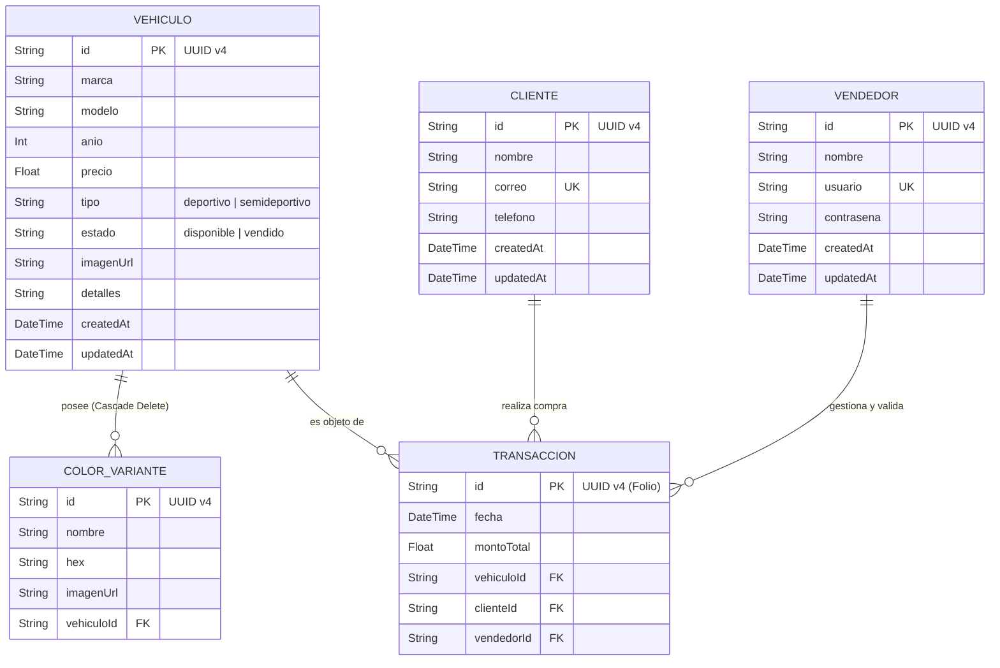

# LocadedCar 🏎️
### *Plataforma Premium de Exhibición, Catálogo y Adquisición de Vehículos Deportivos de Alta Gama*

<p align="center">
  
</p>

<p align="center">
  
  
  
  
  
  
</p>

---

## 🌟 Descripción General

**LocadedCar** es una plataforma web de última generación concebida para la exhibición inmersiva, gestión comercial y adquisición de vehículos deportivos y exóticos (Porsche, Ferrari, Lamborghini, Bugatti, Mercedes-AMG). 

El sistema implementa una sofisticada estética **Apple-style / Liquid Glass** (*Glassmorphism* con efectos translúcidos `backdrop-blur`), animaciones fluidas con **Framer Motion**, renderizado en servidor de alto rendimiento con **Next.js 16 (App Router + Turbopack)** y persistencia relacional con **Prisma ORM**.

---

## ✨ Características Principales

* 🏎️ **Catálogo Exclusivo Dinámico:** Filtrado reactivo por carrocería (*deportivo / semideportivo*), estado de disponibilidad en tiempo real y formateo de divisas oficial `Intl` en Pesos Mexicanos (MXN).
* 🎨 **Ficha Técnica & Visualizador 3D:** Vista de detalle interactiva (`/catalogo/[id]`) con selector cromático reactivo por paletas HEX y visualizador multimedia interactivo con Three.js / React Three Fiber.
* 💳 **Flujo Completo de Checkout & Pago Seguro (`/checkout`):**
  * **Stepper guiado en 3 pasos:** Datos del titular y entrega blindada ➔ Selección de pago seguro ➔ Revisión y confirmación.
  * **Modalidades de compra:** Liquidación de Contado (100%) o Apartado de Chasis (10% de anticipo para congelar la unidad).
  * **Métodos soportados:** Tarjeta bancaria (con simulación interactiva *Black Card*), transferencia interbancaria SPEI VIP directa y financiamiento a 12, 24 y 36 meses.
  * **Comprobante Digital:** Generación de folio oficial de transacción, bloqueo inmediato del chasis a estado `vendido` y recibo imprimible.
* 🛡️ **Panel Administrativo Integral:**
  * **Inventario (`/admin/inventario`):** Control CRUD completo de stock vehicular con actualización instantánea.
  * **CRM de Clientes (`/admin/clientes`):** Registro de prospectos y compradores con enlaces directos `mailto`/`tel` y emisión de cotizaciones.
* 📱 **Arquitectura 100% Responsiva:** Adaptación impecable en dispositivos móviles, tablets y pantallas de ultra-alta resolución.

---

## 📊 Modelo Relacional de Base de Datos

La arquitectura de datos está normalizada en Tercera Forma Normal (3NF), garantizando atomicidad transaccional e integridad referencial:



> 📄 **Documentación Detallada:** Consulta la especificación técnica completa y diccionario de datos en [`docs/Modelos_Relacionales_BD_LocadedCar.pdf`](docs/Modelos_Relacionales_BD_LocadedCar.pdf).

---

## 📋 Matriz de Trazabilidad de Requisitos (ISO 21500 / PMBOK)

El desarrollo del proyecto se rige bajo la matriz de trazabilidad estándar:

| ID | Requisito Técnico Aplicado | Tipo | Prio | Estado | Entregable Asociado | Validación |
| :--- | :--- | :---: | :---: | :---: | :--- | :---: |
| **RF-01** | Catálogo interactivo con React Server Components y filtrado de stock. | Funcional | Alta | Activo | `/catalogo` (`CatalogGrid.tsx`, `CarCard.tsx`) | Aceptado |
| **RF-02** | Ficha de detalle con selector de color HEX y visor Three.js / R3F. | Funcional | Alta | Activo | `/catalogo/[id]` (`CarMediaViewer.tsx`) | Aceptado |
| **RF-03** | Panel administrativo CRUD de inventario vehicular en tiempo real. | Funcional | Alta | Activo | `/admin/inventario` (`page.tsx`) | Aceptado |
| **RF-04** | Módulo CRM para captura y gestión de prospectos y cotizaciones. | Funcional | Media | Activo | `/admin/clientes` (`page.tsx`) | Aceptado |
| **RF-05** | Formulario web de cotización personalizada y contacto VIP. | Negocio | Media | Activo | `/contacto` (`page.tsx`) | Aceptado |
| **RF-06** | Flujo completo de checkout, pago seguro y emisión de ticket digital. | Funcional | Alta | Activo | `/checkout` (`CheckoutClient.tsx`, `/api/checkout`) | Aceptado |
| **RT-01** | Persistencia relacional con Prisma ORM sobre SQLite/PostgreSQL. | Técnico | Alta | Activo | `prisma/schema.prisma`, `seed.ts` | Aceptado |
| **RT-02** | Arquitectura Next.js 16 con App Router, Turbopack y TypeScript. | Técnico | Alta | Activo | `next.config.ts`, `tsconfig.json` | Aceptado |
| **RNF-01**| Sistema de diseño Glassmorphism con Tailwind CSS v4 y Framer Motion. | Calidad/UX| Alta | Activo | `globals.css`, `Navbar.tsx`, `Hero.tsx` | Aceptado |
| **RNF-02**| Control de transacciones atómicas y bloqueo de ventas concurrentes. | Seguridad | Media | Activo | Modelo `Transaccion` & API Handler | Aceptado |

> 📁 Archivos oficiales disponibles en:
> * 📄 [Matriz de Trazabilidad en PDF (`docs/matriz_trazabilidad_requisitos_llenada.pdf`)](docs/matriz_trazabilidad_requisitos_llenada.pdf)
> * 📊 [Matriz de Trazabilidad en CSV para Excel (`docs/matriz_trazabilidad_requisitos.csv`)](docs/matriz_trazabilidad_requisitos.csv)

---

## 🚀 Estructura del Proyecto

```text
LocadedCar/
├── docs/                                # Documentación formal (PDFs y CSVs)
│   ├── Modelos_Relacionales_BD_LocadedCar.pdf
│   ├── matriz_trazabilidad_requisitos_llenada.pdf
│   └── matriz_trazabilidad_requisitos.csv
├── prisma/                              # Configuración de base de datos ORM
│   ├── schema.prisma                    # Definición de modelos de datos
│   └── seed.ts                          # Poblado de vehículos iniciales
├── public/                              # Recursos estáticos y multimedia
├── src/
│   ├── app/
│   │   ├── admin/
│   │   │   ├── clientes/page.tsx        # CRM de clientes y prospectos
│   │   │   └── inventario/page.tsx      # Gestión de inventario de autos
│   │   ├── api/
│   │   │   └── checkout/route.ts        # Endpoint para procesamiento de compras
│   │   ├── catalogo/
│   │   │   ├── [id]/page.tsx            # Detalle del vehículo y botón de pago
│   │   │   └── page.tsx                 # Catálogo interactivo de autos
│   │   ├── checkout/
│   │   │   ├── CheckoutClient.tsx       # Flujo responsivo de pago en 3 pasos
│   │   │   └── page.tsx                 # Página Server Component de checkout
│   │   ├── contacto/page.tsx            # Contacto y cotizaciones VIP
│   │   ├── nosotros/page.tsx            # Identidad y valores de marca
│   │   ├── globals.css                  # Variables y utilidades Glassmorphism
│   │   ├── layout.tsx                   # Layout global con Navbar y Footer
│   │   └── page.tsx                     # Landing page principal
│   └── components/
│       ├── CarCard.tsx                  # Tarjeta individual con efectos hover
│       ├── CarMediaViewer.tsx           # Visor 3D y selector cromático
│       ├── CatalogGrid.tsx              # Cuadrícula responsiva de autos
│       ├── Hero.tsx                     # Sección hero con animaciones
│       └── Navbar.tsx                   # Barra de navegación translúcida
├── .env.example                         # Plantilla de variables de entorno
├── next.config.ts                       # Configuración del compilador Next.js
├── package.json                         # Dependencias y scripts de ejecución
├── tsconfig.json                        # Configuración estricta de TypeScript
└── README.md                            # Documentación principal del repositorio
```

---

## 🛠️ Instalación y Puesta en Marcha

### 1. Clonar el repositorio
```bash
git clone https://github.com/YvnPretty/LocadedCar.git
cd LocadedCar
```

### 2. Configurar variables de entorno
Copia el archivo `.env.example`:
```bash
cp .env.example .env
```

### 3. Instalar dependencias
```bash
npm install
```

### 4. Inicializar y poblar la Base de Datos
```bash
npx prisma generate
npx prisma db push
npx prisma db seed
```

### 5. Iniciar en Modo Desarrollo
```bash
npm run dev
```
Abre en tu navegador: [http://localhost:3000](http://localhost:3000)

### 6. Compilar y Levantar en Producción
```bash
npm run build
npm run start
```

---

## 👤 Autor & Licencia

Desarrollado por **YvngMolly** y el equipo de ingeniería de **LocadedCar**.  
Proyecto académico y demostrativo de alta gama para ingeniería de software.
