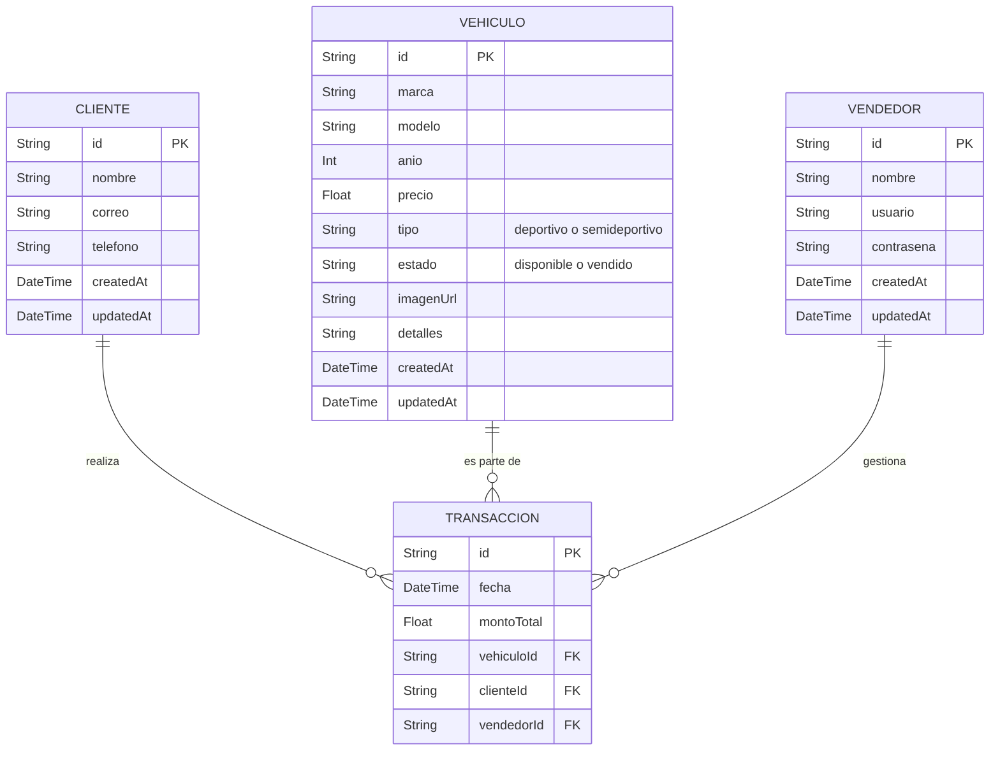

# LocadedCar 🏎️

Plataforma premium para la gestión, catálogo y exhibición de vehículos deportivos y semideportivos, diseñada con una estética sofisticada de alta gama (*translucent liquid glass* / estilo Apple).

## 🚀 Tecnologías Principales

- **Frontend:** Next.js 15 (App Router), React, Tailwind CSS (Glassmorphism UI).
- **Animaciones:** Framer Motion para micro-interacciones fluidas.
- **Base de Datos & ORM:** Prisma ORM con SQLite (migrable a PostgreSQL para producción).

---

## 📊 Modelo de Base de Datos (Entity-Relationship)

El siguiente modelo ilustra la estructura de la base de datos gestionada mediante Prisma. GitHub renderiza esto automáticamente como una imagen/diagrama:



---

## 🛠️ Instalación y Desarrollo Local

1. Instala las dependencias:
   ```bash
   npm install
   ```

2. Configura la base de datos (SQLite por defecto):
   ```bash
   npx prisma db push
   npx prisma generate
   ```

3. Inicia el servidor de desarrollo:
   ```bash
   npm run dev
   ```

4. Abre [http://localhost:3000](http://localhost:3000) en tu navegador para ver la plataforma en funcionamiento.
