# 🏎️ LocadedCar: Luxury Motors Platform
## Especificación Técnica, Arquitectura de Roles y Dossier Comercial de Venta

**Versión del Software:** 2.0 Enterprise Commercial Edition  
**Fecha de Publicación:** Septiembre de 2026  
**Equipo de Ingeniería:** BYTE-FORCE / Equipo de Desarrollo y Arquitectura Web  
**Estándar de Calidad:** ISO 21500 (Dirección de Proyectos) / PMBOK 5ta Ed.

---

## 1. 💼 Resumen Ejecutivo y Propuesta de Valor (Para Vender el Software)

### ¿Qué es LocadedCar?
**LocadedCar** es una solución tecnológica integral diseñada específicamente para **concesionarias de hiperlujo, agencias de autos deportivos y casas de subasta vehicular**. Integra en un único ecosistema:
1. Una **experiencia pública inmersiva (Showroom)** para compradores de alto poder adquisitivo.
2. Una **Terminal de Punto de Venta (POS)** de ultra-velocidad para mostrador con cobro multimodal y cálculo de cambio.
3. Un **Portal Administrativo y Gerencial** para auditoría financiera, CRM de clientes VIP y control de inventario en tiempo real.

### ¿Por qué una agencia debe comprar este software? (Puntos Clave de Venta)
* **Elimina la venta duplicada de unidades exclusivas:** En el mercado de autos de superlujo, cada chasis (VIN) es único. LocadedCar implementa **bloqueo transaccional atómico**; si dos vendedores o clientes intentan apartar o comprar la misma unidad en el mismo milisegundo, la base de datos protege la operación y evita conflictos legales millonarios.
* **Diseño "Cyber-Luxury" que vende:** A diferencia de los puntos de venta grises y aburridos de hace 20 años (estilo supermercado), LocadedCar ofrece una estética *Glassmorphism* inspirada en cockpits automotrices y Apple Store, lo que genera confianza inmediata en clientes que compran autos de más de 3 millones de pesos.
* **Cobro Multimodal Adaptado a México:** Soporta pago con Tarjetas Bancarias de Alta Gama (Black Card), Transferencia Interbancaria SPEI con clave de rastreo Banxico, Efectivo con calculadora reactiva de cambio y Cotizador de Financiamiento con cálculo de cuotas mensuales.
* **Ticket y Contrato Fiscal Digital:** Emite al instante recibos oficiales con código de barras interactivo, código QR de verificación de garantía y estilos automáticos para impresión física en impresoras de tickets térmicos (80mm) o formato carta.

---

## 2. 👥 Matriz de Separación de Roles de Usuario

Para comercializar el producto de manera formal, la arquitectura separa de forma tajante las **tres fronteras de usuario**:

```mermaid
graph TD
    User([Acceso al Sistema]) --> PublicPortal[Rol 1: Comprador / Cliente Showroom]
    User --> POSPortal[Rol 2: Asesor Comercial / Cajero POS]
    User --> AdminPortal[Rol 3: Gerencia / Administrador General]

    subgraph "Rol 1: Experiencia de Compra (Pública)"
        PublicPortal --> Home["Landing Page (/)"]
        PublicPortal --> Catalogo["Catálogo Interactivo (/catalogo)"]
        PublicPortal --> Detalle["Ficha Técnica & Visor 3D (/catalogo/[id])"]
        PublicPortal --> Checkout["Pasarela Autoservicio (/checkout)"]
        PublicPortal --> Contacto["Citas VIP (/contacto)"]
    end

    subgraph "Rol 2: Operación en Mostrador"
        POSPortal --> POSTerminal["Terminal de Ventas Rápida (/pos)"]
        POSTerminal --> SelectorVariante["Configuración Cromática"]
        POSTerminal --> AltaComprador["Captura Express de Cliente"]
        POSTerminal --> CobroMultimodal["Calculadora TPV, SPEI, Efectivo"]
        POSTerminal --> EmisionTicket["Ticket Fiscal con Barcode & QR"]
        POSTerminal --> CorteCaja["Cierre y Arqueo de Turno"]
    end

    subgraph "Rol 3: Gobierno y Finanzas"
        AdminPortal --> Dashboard["Dashboard Ejecutivo (/admin)"]
        AdminPortal --> Inventario["Control de Flota y Stock (/admin/inventario)"]
        AdminPortal --> CRM["CRM & Inversión LTV (/admin/clientes)"]
        AdminPortal --> Auditoria["Libro Mayor de Ventas (/admin/ventas)"]
        AdminPortal --> Leads["Bandeja de Cotizaciones (/admin/cotizaciones)"]
    end
```

---

## 3. 🖥️ Especificación Detallada de Vistas por Rol

### ROL 1: PORTAL PÚBLICO DEL CLIENTE (Showroom Digital)
* **Público Objetivo:** Compradores de lujo, coleccionistas e inversionistas.
* **Frontera de Seguridad:** Totalmente aislada; no muestra botones de administración ni accesos internos que distraigan de la compra.
* **Pantallas Integradas:**
  1. **Landing Page (`/`):** Hero visual con tipografía vanguardista, llamado a la acción inmersivo y destacados del mes.
  2. **Catálogo con Filtrado Reactivo (`/catalogo`):** Renderizado del lado del servidor (RSC) que permite filtrar entre carrocerías *Deportivas* y *Semideportivas* con formateo de divisas oficial en pesos mexicanos (`Intl.NumberFormat('es-MX')`).
  3. **Ficha de Detalle y Configurador (`/catalogo/[id]`):** Visor multimedia con selector de paletas HEX que intercambia en tiempo real la fotografía de la unidad según el acabado de pintura elegido.
  4. **Pasarela de Compra Autoservicio (`/checkout`):** Flujo de 3 pasos (Datos de entrega, selección de forma de pago y confirmación).
  5. **Footer Institucional (`Footer.tsx`):** Garantías, información legal de la marca y un enlace discreto de **Portal Staff** para que el personal autorizado acceda a sus módulos.

---

### ROL 2: TERMINAL DE PUNTO DE VENTA (POS Cockpit)
* **Público Objetivo:** Vendedores de piso, asesores concierge y cajeros de agencia.
* **Ruta Exclusiva:** `/pos` (Diseño a pantalla completa, eliminando distracciones del menú público).
* **Módulos de la Cabina POS:**
  1. **Barra HUD Superior:** Reloj digital en vivo sincronizado con el huso horario de la sucursal, indicador de estación de cobro activa (`POS-01`) y nombre del asesor en turno.
  2. **Showroom de Despacho Rápido (Panel Izquierdo):** Buscador instantáneo por texto, chips de filtrado (*Solo Disponibles*, *Deportivos*, *Semideportivos*), selector cromático en tarjeta y botón táctil de carga a mostrador.
  3. **Cockpit de Cobro (Panel Derecho):**
     * Fotomappeo y telemetría de la unidad seleccionada.
     * Selector y alta exprés de cliente VIP con RFC y teléfono.
     * Modos de venta: *100% Contado*, *10% Apartado/Reserva* o *Enganche Libre*.
     * Métodos en mostrador: Tarjeta TPV (Black Card), SPEI con CLABE interbancaria STP, Efectivo con cálculo de cambio en tiempo real y Financiamiento a 12-48 mensualidades.
  4. **Ticket Fiscal y Comprobante Imprimible:**
     * Generación de Folio Fiscal Oficial (`LCD-POS-2026-XXXXXX`).
     * Código de barras dinámico en vectores SVG.
     * Código QR con metadatos de garantía.
     * Desglose de IVA (16%), base imponible y desglose de efectivo recibido / cambio devuelto.
     * Optimización CSS para impresión térmica o formato carta con un solo clic.
  5. **Corte de Turno (Drawer Lateral):** Telemetría en vivo del total recaudado en el turno, unidades despachadas y stock disponible.

---

### ROL 3: PORTAL ADMINISTRATIVO Y GERENCIAL
* **Público Objetivo:** Directores de agencia, gerentes de ventas y auditores contables.
* **Ruta Base:** `/admin` (Layout con navegación lateral y selector de roles superior).
* **Pantallas Integradas:**
  1. **Dashboard General (`/admin`):**
     * 4 Tarjetas de Rendimiento Clave (KPIs): Ingresos totales liquidados, valor monetario de la flota en piso, unidades despachadas y cartera de clientes.
     * Tabla de últimas transacciones en tiempo real.
  2. **Gestión de Inventario (`/admin/inventario`):**
     * Catálogo maestro de unidades con filtros por disponibilidad.
     * Modal interactivo para dar de alta vehículos con fotos, motor y especificaciones.
     * Botón de 1 clic para alternar estado entre *Disponible* y *Vendido*.
  3. **CRM de Clientes VIP (`/admin/clientes`):**
     * Tarjetas de titulares de cuenta con cálculo de inversión acumulada (LTV).
     * Historial de autos comprados por cada cliente.
     * Enlaces directos para envío de correos y llamadas telefónicas.
  4. **Auditoría de Ventas (`/admin/ventas`):**
     * Libro mayor inmutable de transacciones con folio fiscal, fecha, vehículo, comprador y asesor responsable.
  5. **Bandeja de Cotizaciones (`/admin/cotizaciones`):**
     * Pipeline comercial de prospectos capturados a través del formulario web para seguimiento o conversión directa a venta en POS.

---

## 4. 🏗️ Arquitectura Técnica y Stack Tecnológico

| Capa | Tecnología | Justificación Técnica |
| :--- | :--- | :--- |
| **Framework Web** | **Next.js 16.3.4 (App Router)** | Renderizado híbrido (RSC para carga instantánea de catálogos y Client Components para interactividad en POS). Compilación ultrarrápida con Turbopack. |
| **Capa de Estilos** | **Tailwind CSS v4** | Sistema de diseño Glassmorphism con clases utilitarias modernas (`backdrop-blur`, gradientes translúcidos) y variables de color de alta fidelidad. |
| **Animaciones & HUD** | **Framer Motion v13** | Transiciones suaves entre estados de selección, modales y drawers laterales. |
| **Persistencia / ORM** | **Prisma ORM v5.22** | Modelado estricto con TypeScript. Facilidad de migración instantánea entre SQLite (desarrollo local) y PostgreSQL/MySQL (producción en la nube). |
| **Atomicidad / ACID** | **Prisma `$transaction`** | Garantiza que la venta, la asignación de cliente y el cambio de estado a vendido se ejecuten como una única unidad lógica indivisible. |
| **Visor Multimedia** | **Three.js / React Three Fiber** | Capacidad de inspección tridimensional y fotomappeo dinámico de pintura. |

---

## 5. 🎤 Guion de Presentación y Venta (Pitch de Venta)

Si tienes que presentar o vender este sistema a un cliente, socio o evaluador, sigue estos **4 pasos estructurados**:

### Paso 1: Introducción y Planteamiento del Problema (1 minuto)
> *"La mayoría de los sistemas de venta de autos usan interfaces lentas y formularios grises que no representan el lujo de los vehículos que se comercializan. Además, suelen generar inconsistencias cuando dos vendedores intentan apartar la misma unidad. **LocadedCar** resuelve esto uniendo una experiencia digital inmersiva para el comprador, una terminal de cobro de alta velocidad para el asesor, y una consola gerencial para el dueño del negocio."*

### Paso 2: Demostración del Showroom Público (2 minutos)
1. Abre [http://localhost:3000](http://localhost:3000).
2. Muestra el diseño visual oscuro, el catálogo de autos y cómo cambian las fotos al seleccionar colores en la ficha del vehículo.
3. Señala que la experiencia del cliente está completamente limpia de opciones técnicas o botones de administración.

### Paso 3: Demostración en Vivo de la Terminal POS (3 minutos)
1. Entra a [http://localhost:3000/pos](http://localhost:3000/pos).
2. Destaca la **cabina dual**:
   * A la izquierda, busca un auto (ej. *Porsche* o *Audi*) y cárgalo con un clic.
   * A la derecha, selecciona un cliente frecuente o usa el botón de alta rápida.
   * Cambia la modalidad a **Apartado (10%)** o **Liquidación Total (100%)** y muestra cómo se calculan el IVA y el Subtotal de inmediato.
   * Elige el método **Efectivo**, introduce una cifra y demuestra cómo la calculadora entrega el cambio exacto en tiempo real.
   * Presiona **"Procesar Despacho y Emitir Ticket POS"**.
3. Muestra el **Ticket Fiscal con código de barras y código QR**: explica que está listo para imprimirse en impresoras de tickets térmicos o guardarse en digital.
4. Abre el **Corte de Turno** en la esquina superior derecha para mostrar cómo los ingresos aumentaron de inmediato.

### Paso 4: Demostración del Panel Administrativo (2 minutos)
1. Ingresa a [http://localhost:3000/admin](http://localhost:3000/admin).
2. Muestra los 4 indicadores financieros en vivo calculados directamente de la base de datos relacional.
3. Abre `/admin/inventario` y demuestra cómo el auto recién vendido ya aparece bloqueado como *VENDIDO*, impidiendo cualquier error humano.
4. Muestra `/admin/ventas` con el libro mayor de auditoría y `/admin/clientes` con el valor acumulado (LTV) del comprador.

---

**Conclusión:**  
LocadedCar no es una simple página web; es un **sistema de información empresarial transaccional de extremo a extremo** listo para operar y comercializarse en el mercado automotriz premium.
