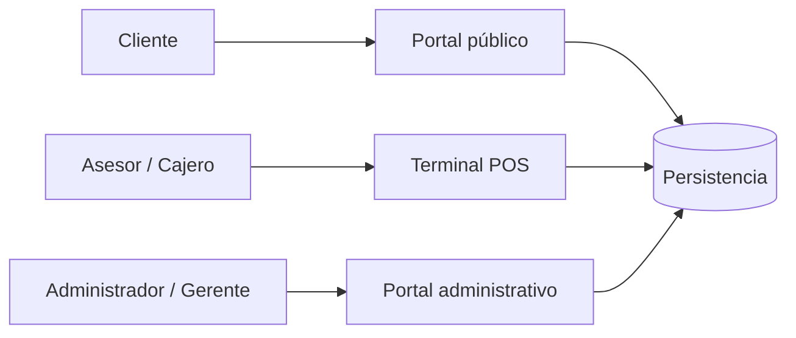
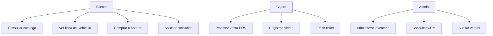
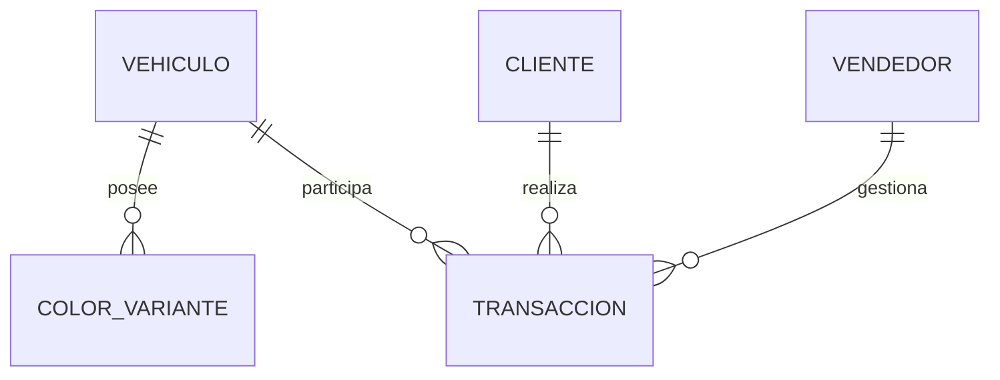

# LocadedCar
## Presentación técnica del proyecto

**Equipo:** Granados Sánchez Azucena, Arteaga Villar Said Edgar, López Salazar, Vanegas Villar Lizbeth y Meza Corella Cesae

---

## Diapositiva 1. Propósito del sistema

### LocadedCar: plataforma comercial para vehículos deportivos de alta gama

- Showroom digital para clientes.
- Terminal POS para asesores y cajeros.
- Portal administrativo para gerencia.
- Catálogo, checkout, CRM, inventario y auditoría en un mismo sistema.

### Speech

LocadedCar no se diseñó como una página informativa aislada. Se diseñó como un sistema de información empresarial para una agencia de vehículos deportivos y de colección. El problema central era conectar tres necesidades: la experiencia de compra del cliente, la operación rápida del personal de ventas y el control administrativo de las transacciones. La solución integra esas tres perspectivas sin mezclar sus interfaces ni sus responsabilidades.

---

## Diapositiva 2. Problema identificado

- Catálogos poco diferenciados y con baja capacidad de conversión.
- Riesgo de vender o apartar dos veces una unidad única.
- Información de clientes dispersa.
- Procesos de venta manuales y difíciles de auditar.
- Falta de visibilidad para la gerencia.

### Speech

En este dominio cada vehículo representa una unidad de alto valor y, en muchos casos, un chasis único. Por eso el problema no era únicamente visual. También era transaccional: el sistema debía mantener consistencia entre inventario, comprador, vendedor e importe. Además, una venta sin trazabilidad limita la operación gerencial. A partir de ese diagnóstico se definieron los requisitos funcionales y no funcionales que dieron origen a la matriz de trazabilidad.

---

## Diapositiva 3. Actores y separación de roles

- Cliente: consulta, cotiza, aparta o compra.
- Asesor/cajero: procesa operaciones en mostrador.
- Administrador: controla inventario, clientes y ventas.

### Speech

La separación de roles se implementó también a nivel de interfaz. El cliente no ve una consola administrativa; el POS no depende de la navegación pública; y la gerencia dispone de un layout propio. Esta decisión reduce ruido visual y evita que una vista orientada a una actividad interfiera con otra. El aislamiento es funcional y visual, aunque la versión actual todavía requiere incorporar autenticación real para convertirse en un control de acceso productivo.

---

## Diapositiva 4. Análisis y trazabilidad de requisitos

- Identificación de actores y procesos.
- Clasificación funcional / no funcional.
- Priorización por impacto comercial.
- Asociación requisito → módulo → validación.
- Matriz disponible en CSV y PDF.

### Speech

El análisis partió del problema operativo y se tradujo a procesos observables: consultar catálogo, revisar una unidad, registrar un cliente, procesar una venta y auditar el resultado. Después se separaron requisitos funcionales, como el checkout o el inventario, de requisitos no funcionales, como la responsividad, la consistencia transaccional y la arquitectura. La matriz de trazabilidad evita que los requisitos queden como declaraciones abstractas: cada uno se vincula con un entregable concreto y una forma de validación.

---

## Diapositiva 5. Delimitación y fronteras del sistema

### Incluye

- Portal público, catálogo y fichas técnicas.
- Checkout y POS con pago simulado.
- Inventario, clientes, cotizaciones y auditoría.
- Persistencia de vehículos, clientes, vendedores y transacciones.

### Entradas

- Datos de vehículos y clientes.
- Modalidad, método de pago e importe.
- Altas y actualizaciones administrativas.

### Salidas

- Totales, anticipos y cambio simulado.
- Folios, comprobantes y tickets.
- Estados de inventario, indicadores y auditoría.

### Speech

Delimitar el sistema significa definir sus fronteras y su responsabilidad. LocadedCar recibe información de vehículos, compradores y operaciones comerciales; procesa esa información dentro del dominio de la agencia; y produce catálogos, cálculos, comprobantes, cambios de estado y reportes administrativos. Interactúa con Prisma, SQLite, GitHub, Railway y los recursos multimedia, pero no controla esos servicios como parte del negocio.

### Speech: exclusiones y responsabilidad

El sistema no autoriza cargos bancarios reales, no emite facturas fiscales, no valida oficialmente un RFC, no autentica usuarios para un ambiente productivo y no coordina la entrega física del vehículo. Esas responsabilidades pertenecen a bancos, proveedores fiscales, servicios de identidad y operadores logísticos. Por tanto, el alcance termina en la coordinación, simulación y registro del flujo comercial dentro de la aplicación. Esta frontera permite evaluar el proyecto con precisión y evita afirmar que un prototipo funcional reemplaza servicios certificados.

---

## Diapositiva 6. Arquitectura tecnológica

| Capa | Tecnología | Función |
| :--- | :--- | :--- |
| Aplicación | Next.js 16 App Router | Rutas, Server Components y API Routes |
| Interfaz | React 19 + Tailwind CSS 4 | Vistas responsive y componentes reutilizables |
| Interacción | Framer Motion + Lucide | Animaciones y lenguaje visual |
| Persistencia | Prisma ORM 5 + SQLite | Modelo relacional y acceso tipado |
| Multimedia | Three.js / React Three Fiber | Visualización interactiva |
| Despliegue | GitHub + Railway | Control de versiones y entrega continua |

### Speech

La arquitectura combina renderizado del servidor para los datos de catálogo con componentes cliente para la interacción intensa del POS y del checkout. Prisma funciona como frontera tipada entre la aplicación y la base de datos. Esta elección reduce consultas no estructuradas y permite expresar las relaciones del dominio mediante el esquema. GitHub administra el código y Railway ejecuta el servicio Node de Next.js desde la rama principal.

---

## Diapositiva 7. Modelo de casos de uso

### Speech

El modelo de casos de uso representa qué puede hacer cada actor, no cómo está programado internamente. El cliente opera sobre el catálogo y el checkout; el cajero ejecuta el flujo de mostrador; y el administrador consulta o modifica información de gobierno. Esta representación permitió verificar que cada módulo tuviera un actor responsable y que no existieran funciones importantes sin una vista o un proceso asociado.

---

## Diapositiva 8. 4. Representación del modelo de dominio

- `Vehiculo`: unidad comercial y estado del inventario.
- `ColorVariante`: configuración visual de la unidad.
- `Cliente`: titular de la compra.
- `Vendedor`: responsable de la operación.
- `Transaccion`: evidencia de la operación comercial.

### Speech

El agregado central es el vehículo, porque su estado determina si puede seguir comercializándose. Las variantes de color dependen del vehículo. Cliente y vendedor representan los participantes de la operación. La transacción conecta esos elementos y conserva el importe y la fecha. El modelo se diseñó para que una venta no sea solo un monto: sea un registro trazable de qué unidad se operó, quién la compró y quién la gestionó.

---

## Diapositiva 9. Flujos de negocio

### Cliente

`Catálogo → Ficha → Modalidad → Datos → Pago simulado → Confirmación`

### POS

`Inventario → Cliente → Modalidad → Método de cobro → Transacción → Ticket`

### Administración

`Dashboard → Inventario / CRM / Ventas → Indicadores y auditoría`

### Speech

Los flujos se diseñaron para reducir pasos innecesarios. El cliente puede llegar a una compra desde una unidad concreta del catálogo. El POS concentra la operación en una sola estación y calcula el total según la modalidad. La administración no interviene en el flujo de compra, sino que recibe la información consolidada para supervisar inventario, clientes e ingresos.

---

## Diapositiva 10. 5. Estudio de factibilidad técnica y operativa: costo-beneficio

| Área | Conclusión |
| :--- | :--- |
| Técnica | Factible con tecnologías web maduras y una arquitectura modular. |
| Operativa | Factible porque cada rol tiene un flujo y una interfaz especializada. |
| Económica | Favorable para un MVP por el uso de herramientas open source y módulos reutilizables. |
| Escalabilidad | Requiere PostgreSQL, volumen persistente, autenticación y servicios de pago para producción ampliada. |

### Speech

La factibilidad técnica es favorable porque el stack es conocido, modular y desplegable como servicio Node. La factibilidad operativa se sustenta en la separación de roles y en la reducción de tareas manuales. La relación costo-beneficio aparece al centralizar catálogo, captación, cobro y auditoría en una misma plataforma. El costo de una primera versión se mantiene bajo; sin embargo, un ambiente comercial real debe invertir en base administrada, autenticación, respaldo, observabilidad y proveedores regulados de pago.

---

## Diapositiva 11. 6. Metodología de desarrollo de software

- Enfoque incremental y ágil.
- Entrega por módulos verificables.
- Validación continua con build y pruebas de flujo.
- Git para control de versiones.
- GitHub para colaboración, historial y repositorio remoto.
- Railway conectado a `main` para despliegue continuo.

### Speech

La metodología no fue GitHub. GitHub fue la plataforma de colaboración y control de versiones. El enfoque de desarrollo fue incremental y ágil: se construyó el sistema por módulos, se validó cada incremento y se integraron los cambios de manera continua. El historial de commits permitió separar decisiones, recuperar versiones y mantener una relación visible entre código y documentación. La conexión con Railway convirtió el push a `main` en el disparador de entrega del servicio.

---

## Diapositiva 12. Validación y estado actual

- Build de producción validado con Next.js.
- Prisma genera y sincroniza el esquema.
- Seed idempotente para no borrar registros existentes.
- Flujos de compra probados desde catálogo.
- Ventas visibles en auditoría administrativa.
- Aplicación desplegada en Railway.

### Speech

La validación se hizo sobre el comportamiento y sobre la compilación. Se verificó el recorrido completo desde el catálogo hasta el comprobante y después se comprobó la aparición de la operación en el módulo administrativo de ventas. También se ajustó el proceso de despliegue para que Prisma genere el cliente, sincronice el esquema y no destruya la información cuando el seed se ejecuta nuevamente. El servicio se encuentra publicado en Railway y consume la aplicación mediante una URL pública.

---

## Diapositiva 13. Cierre técnico

### Resultado

LocadedCar entrega una base funcional para digitalizar la venta de vehículos premium:

- Experiencia pública orientada a conversión.
- Operación POS orientada a velocidad.
- Administración orientada a control.
- Dominio relacional orientado a trazabilidad.
- Despliegue reproducible mediante GitHub y Railway.

### Speech

Como conclusión, LocadedCar resuelve el problema propuesto a nivel de prototipo empresarial funcional. No se limita a presentar una interfaz: modela actores, procesos, datos y reglas de negocio. La matriz de requisitos, los casos de uso, el modelo de dominio, el estudio de factibilidad y la metodología documentan por qué se construyó cada módulo y cuáles son sus límites. El siguiente nivel de producción consiste en reemplazar las simulaciones por servicios certificados y fortalecer seguridad, persistencia y observabilidad.

---

## Datos para la demostración

- Producción: <https://locadedcar-production.up.railway.app>
- Catálogo: <https://locadedcar-production.up.railway.app/catalogo>
- POS: <https://locadedcar-production.up.railway.app/pos>
- Ventas: <https://locadedcar-production.up.railway.app/admin/ventas>
- Repositorio: <https://github.com/YvnPretty/LocadedCar>

## Preguntas previsibles

### ¿El pago es real?

No. El flujo de pago es una simulación funcional. No se conectan tarjetas reales ni se ejecutan cargos bancarios.

### ¿Por qué SQLite?

SQLite reduce la complejidad del prototipo y permite validar el dominio rápidamente. Para producción de mayor escala se recomienda PostgreSQL administrado con respaldos y volumen persistente.

### ¿GitHub es la metodología?

No. GitHub es la plataforma de control de versiones y colaboración. La metodología aplicada es incremental y ágil, con entregas por módulos y validación continua.

### ¿Existe autenticación?

La separación de portales está implementada a nivel de experiencia y rutas, pero la autenticación y autorización de usuarios deben incorporarse antes de operar con datos reales.